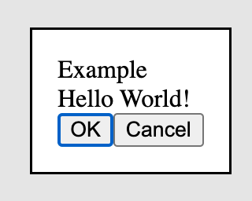
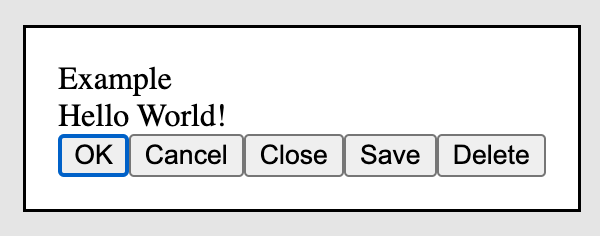
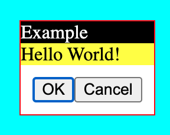
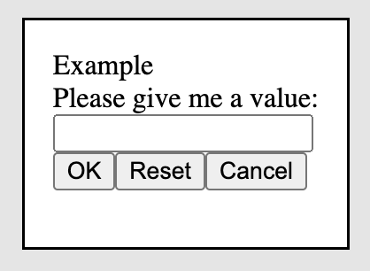

# html-dialog

a simple but flexible html dialog for any frontend.
based on the [html dialog](https://developer.mozilla.org/en-US/docs/Web/HTML/Element/dialog) element.






## dialog installation & usage

### installation in browser

```html

<script src="dist/html-dialog.min.js"></script>
<script>
    var dialog = HtmlDialog.Dialog({
        title: 'Dialog Title',
        content: 'Dialog Content',
        buttons: [
            {
                text: 'OK',
                onclick: function () {
                    console.log('OK');
                }
            },
            {
                text: 'Cancel',
                onclick: function () {
                    console.log('Cancel');
                }
            }
        ]
    }).create();

    dialog.open();
</script>
```

For more examples, see the [example.html](example.html) file.

### installation with npm

install with npm:

```
npm i html-dialog
```

then import the dialog:

```javascript
import {Dialog} from 'html-dialog/dist/html-dialog.esm'

const myDialog = Dialog({...}).create()
myDialog.open()
```

For more examples, see the [example.html](example.html) file.

## dialog methods

```
var dialog = HtmlDialog.Dialog({...});

dialog.create();
dialog.open();
dialog.close();
dialog.destroy();
dialog.getDialog();
dialog.getForm();
```

| method      | description            | return                     |
|-------------|------------------------|----------------------------|
| create()    | adds dialog to DOM     | dialog instance            |
| open()      | open dialog            | dialog instance            |
| close()     | close dialog           | dialog instance            |
| destroy()   | remove dialog from DOM | void                       |
| getDialog() | get dialog element     | dialog element             |
| getForm()   | get form element       | form element inside dialog |

### .create()

You can pass an optional parameter to the `create()` method to specify the parent element.

```javascript
var dialog = HtmlDialog.Dialog({...});
dialog.create({
    appendTo: document.getElementById('my-dialog-container')
});
```

## dialog options

```javascript
HtmlDialog.Dialog({
    title: 'Dialog Title',
    content: 'Dialog Content',
    buttons: [
        // ...
    ],
    classNames: {
        // ...
    }
})
```

| option     | type   | default  | description                                     |
|------------|--------|----------|-------------------------------------------------|
| title      | string | required | dialog title                                    |
| content    | string | required | dialog content, can be any html / string        |
| buttons    | array  | required | dialog buttons, see "buttons option"            |
| classNames | object | {}       | dialog css classnames, see "classNames options" |

## buttons options

```javascript
{
...
    buttons: [
        {
            text: 'OK',
            type: 'button',
            focus: true,
            classNames: 'btn btn-primary',
            onclick: function (mouseevent) {
                console.log(mouseevent);
                this.close();
            }
        }
    ]
...
}
```

| option        | type     | default  | description                               |
|---------------|----------|----------|-------------------------------------------|
| text          | string   | required | button text                               |
| type          | string   | 'button' | button type. can be submit, button, reset |
| focus         | boolean  | false    | focus button on dialog open               |
| classNames    | string   | ''       | button css classnames                     |
| onclick       | function | null     | button callback                           |
| oncontextmenu | function | null     | button callback                           |
| ondblclick    | function | null     | button callback                           |
| ...           | function | null     | button callback                           |

All valid mouse events are supported.
See: https://www.w3schools.com/jsref/obj_mouseevent.asp

The callback function will be called with the dialog instance as `this` and the mouseevent as the first argument.

### classNames options

This option allows you to add custom css classnames to the dialog.

```javascript
HtmlDialog.Dialog({
    title: 'Example',
    content: 'Hello World!',
    buttons: [
        // ...
    ],
    classNames: {
        dialog: 'dialog-class',
        title: 'title-class',
        content: 'content-class',
        buttons: 'buttons-class',
    }
});
```

The above code will result in the following html:

```html

<dialog class="dialog-class">
    <form>
        <div class="title-class">Example</div>
        <div class="content-class">Hello World!</div>
        <div class="buttons-class">
            <button>OK</button>
            <button>Cancel</button>
        </div>
    </form>
</dialog>
```

| option  | type   | default | description         |
|---------|--------|---------|---------------------|
| dialog  | string | ''      | dialog css classes  |
| title   | string | ''      | title css classes   |
| content | string | ''      | content css classes |
| buttons | string | ''      | title css           |

example styles with backdrop:

```css
.dialog-class {
    border: 1px solid red;
    padding: 0;
}

.dialog-class::backdrop {
    background-color: aqua;
}
```

### dialog / prompt example with text input and form validation

```javascript
HtmlDialog.Dialog({
    title: 'Example',
    content: `<div>Please give me a value:</div><input type="text" name="value" required>`,
    buttons: [
        {
            text: 'OK',
            type: 'submit',
            onclick: function () {
                let value = this.querySelector('input[name="value"]').value;
                if (value) {
                    console.log(value);
                    this.close();
                }
            }
        },
        {
            text: 'Reset',
            type: 'reset',
        },
        {
            text: 'Cancel',
            onmouseup: function () {
                this.close();
            }
        }
    ]
}).create().open();
```
